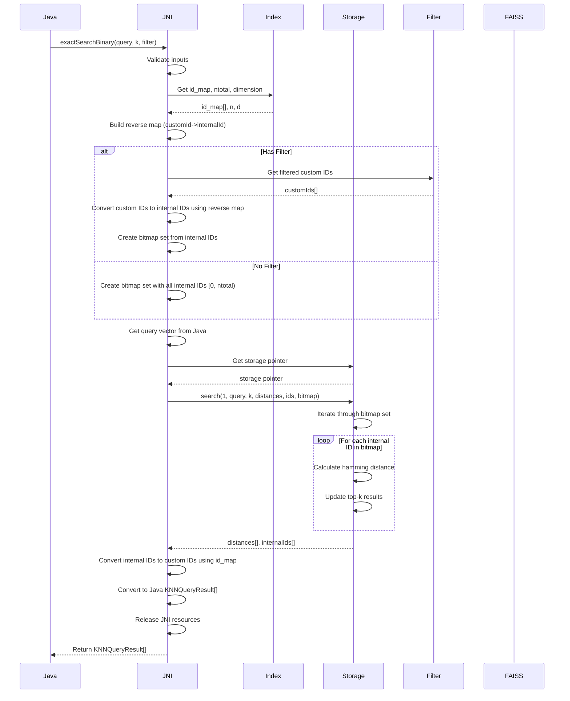

## Complete Sequence Diagram with Hamming Distance API

```mermaid
sequenceDiagram
    participant Java
    participant JNI
    participant Index
    participant Storage
    participant Filter
    participant FAISS
    
    Java->>JNI: exactSearchBinary(query, k, filter)
    JNI->>JNI: Validate inputs
    JNI->>Index: Get id_map, ntotal, dimension
    Index-->>JNI: id_map[], n, d
    
    JNI->>JNI: Build reverse map (customId->internalId)
    
    alt Has Filter
        JNI->>Filter: Get filtered custom IDs
        Filter-->>JNI: customIds[]
        JNI->>JNI: Convert custom IDs to internal IDs using reverse map
        JNI->>JNI: Create bitmap set from internal IDs
    else No Filter
        JNI->>JNI: Create bitmap set with all internal IDs [0, ntotal)
    end
    
    JNI->>JNI: Get query vector from Java
    JNI->>Storage: Get storage pointer
    Storage-->>JNI: storage pointer
    
    JNI->>Storage: search(1, query, k, distances, ids, bitmap)
    Storage->>Storage: Iterate through bitmap set
    loop For each internal ID in bitmap
        Storage->>Storage: Calculate hamming distance
        Storage->>Storage: Update top-k results
    end
    Storage-->>JNI: distances[], internalIds[]
    
    JNI->>JNI: Convert internal IDs to custom IDs using id_map
    JNI->>JNI: Convert to Java KNNQueryResult[]
    JNI->>JNI: Release JNI resources
    JNI-->>Java: Return KNNQueryResult[]
```