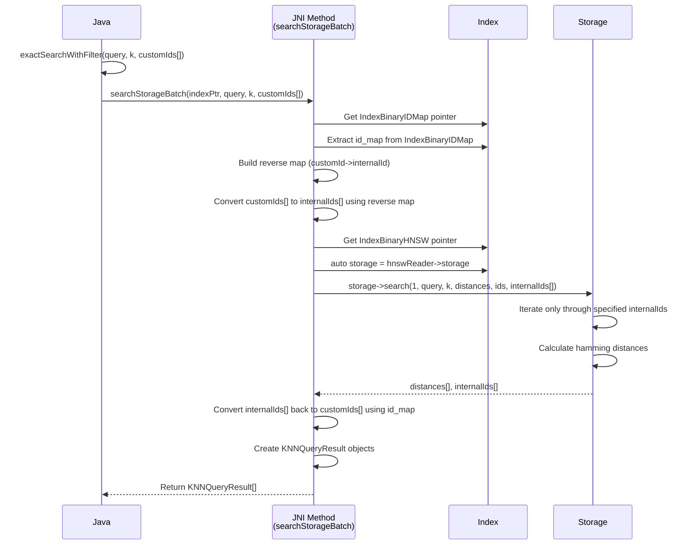
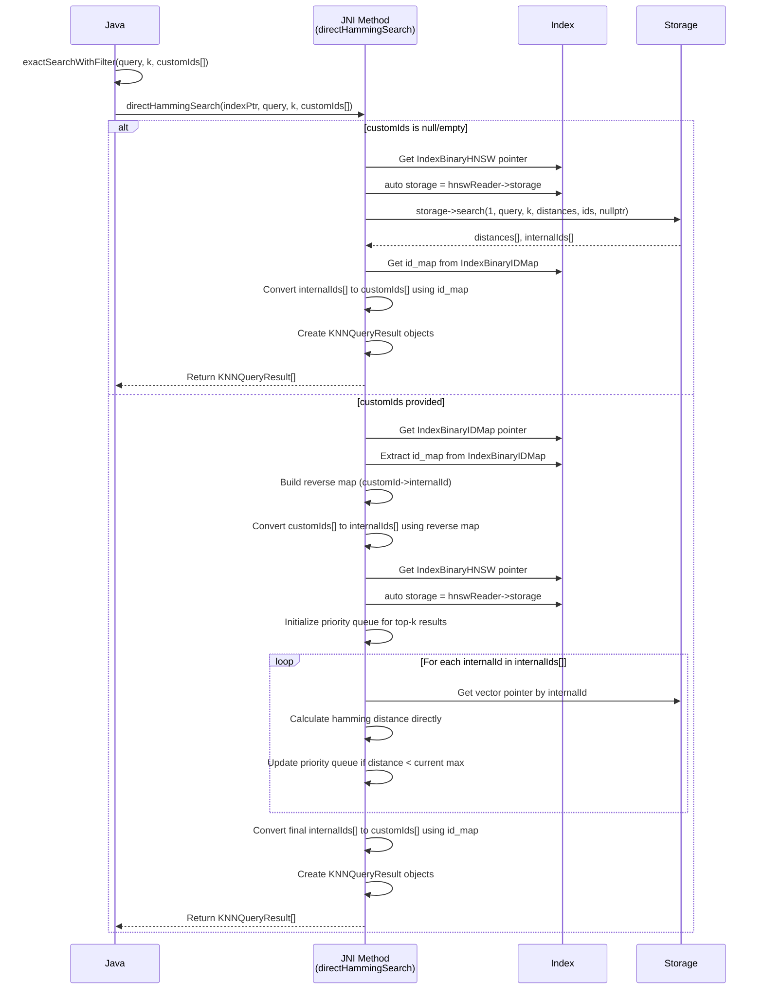
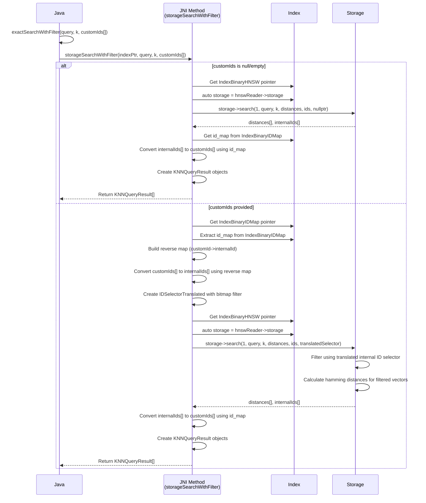

## Refined Approach 2: Single JNI Call with Batch Processing

## Approach 3: Direct Hamming Distance Calculation

## Complexity Comparison: Approach 1 vs Approach 2

### Approach 1 (Two JNI Calls)
**Time Complexity:**
- JNI Call 1: O(n) - extract id_map
- Java processing: O(n + m) - build reverse map + convert customIds
- JNI Call 2: O(m * log k) - search with bitmap filter

**Space Complexity:**
- Java: O(n + m) - id_map array + reverse map
- JNI: O(m) - bitmap/filter data

**Overhead:**
- 2 JNI boundary crossings
- Java heap allocation for id_map array
- Java HashMap operations for reverse mapping

### Approach 2 (Single JNI Call)
**Time Complexity:**
- Single JNI Call: O(n + m + m * log k) - extract id_map + build reverse map + search

**Space Complexity:**
- JNI: O(n + m) - id_map + reverse map in native memory

**Overhead Reduction:**
- 1 JNI boundary crossing (50% reduction)
- No Java heap allocation for id_map
- Native C++ unordered_map (faster than Java HashMap)
- Eliminates Java GC pressure from temporary objects

**Performance Gains:**
- Reduced JNI overhead: ~10-20% improvement
- Better memory locality: id mapping done in same memory space as search
- No Java object creation for intermediate data structures
## Approach 4: Storage Search with Bitmap Translation

