# Exact Search JNI Implementation - Mermaid Diagrams

## Main Flow with Early Filter Check

```mermaid
flowchart TD
    Start([Java calls exactSearchBinary]) --> ValidateInput{Validate Input?}
    ValidateInput -->|Invalid| ThrowError[Throw Exception]
    ValidateInput -->|Valid| ExtractIndex[Extract Index Components<br/>indexReader, storage, id_map]
    
    ExtractIndex --> GetQuery[Get Query Vector<br/>from Java byte array]
    GetQuery --> HasFilter{Has Filter?}
    
    HasFilter -->|No| ComputeAll[Compute distances<br/>for ALL vectors]
    HasFilter -->|Yes| BuildFilter[Build Filter Set<br/>from custom IDs]
    
    BuildFilter --> BuildReverseMap[Build Reverse Map<br/>customId → internalId]
    BuildReverseMap --> LoopStart[Initialize: i = 0<br/>results = empty]
    
    LoopStart --> CheckLoop{i < ntotal?}
    CheckLoop -->|No| SortResults[Sort results by distance]
    CheckLoop -->|Yes| GetCustomId[customId = id_map[i]]
    
    GetCustomId --> CheckFilter{Filter contains<br/>customId?}
    CheckFilter -->|No| IncrementSkip[i++]
    CheckFilter -->|Yes| ComputeDist[Compute Hamming Distance<br/>dist = hamming query, storage[i]]
    
    ComputeDist --> StoreResult[Store: results.push<br/>distance, customId]
    StoreResult --> Increment[i++]
    Increment --> CheckLoop
    IncrementSkip --> CheckLoop
    
    ComputeAll --> SortAll[Sort all results]
    SortAll --> SortResults
    
    SortResults --> GetTopK[Get top-k results<br/>min k, results.size]
    GetTopK --> ConvertJava[Convert to Java<br/>KNNQueryResult array]
    
    ConvertJava --> Cleanup[Release JNI resources<br/>query, filter arrays]
    Cleanup --> Return([Return results to Java])
    
    ThrowError --> End([End])
    Return --> End
    
    style Start fill:#e1f5e1
    style Return fill:#e1f5e1
    style End fill:#ffe1e1
    style CheckFilter fill:#fff4e1
    style ComputeDist fill:#e1f0ff
```

## Detailed Distance Computation with Filter

```mermaid
flowchart TD
    Start([Start Distance Loop]) --> Init[i = 0<br/>results = empty<br/>filtered_count = 0]
    
    Init --> Loop{i < ntotal?}
    
    Loop -->|No| Done[Return results<br/>filtered_count items]
    Loop -->|Yes| MapId[Map internal to custom:<br/>customId = id_map[i]]
    
    MapId --> HasFilter{Has Filter?}
    
    HasFilter -->|No| Compute[Compute Distance]
    HasFilter -->|Yes| CheckMember{Filter contains<br/>customId?}
    
    CheckMember -->|No| Skip[Skip this vector<br/>i++]
    CheckMember -->|Yes| Compute
    
    Compute --> CalcHamming[dist = faiss::hamming<br/>query, storage + i*d/8, d/8]
    CalcHamming --> Store[results.push<br/>dist, customId]
    Store --> IncCount[filtered_count++]
    IncCount --> Next[i++]
    Next --> Loop
    Skip --> Loop
    
    Done --> End([End])
    
    style Start fill:#e1f5e1
    style End fill:#e1f5e1
    style CheckMember fill:#fff4e1
    style CalcHamming fill:#e1f0ff
    style Skip fill:#ffe1e1
```

## Filter Building Process

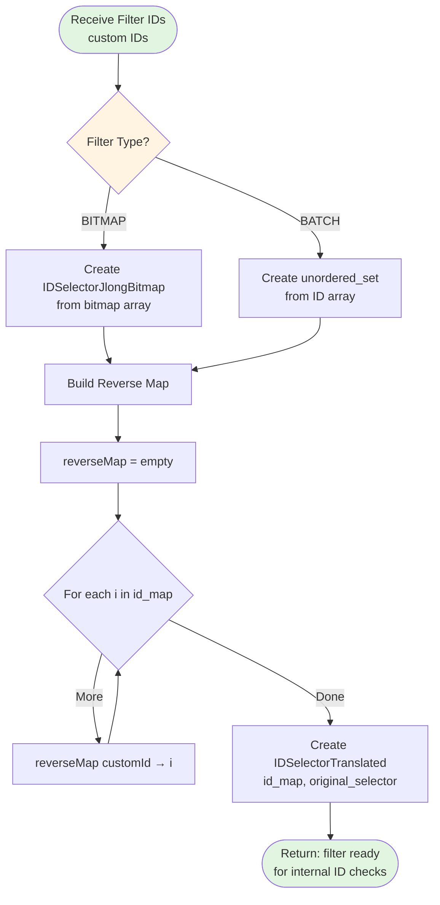

## Top-K Selection with Partial Sort

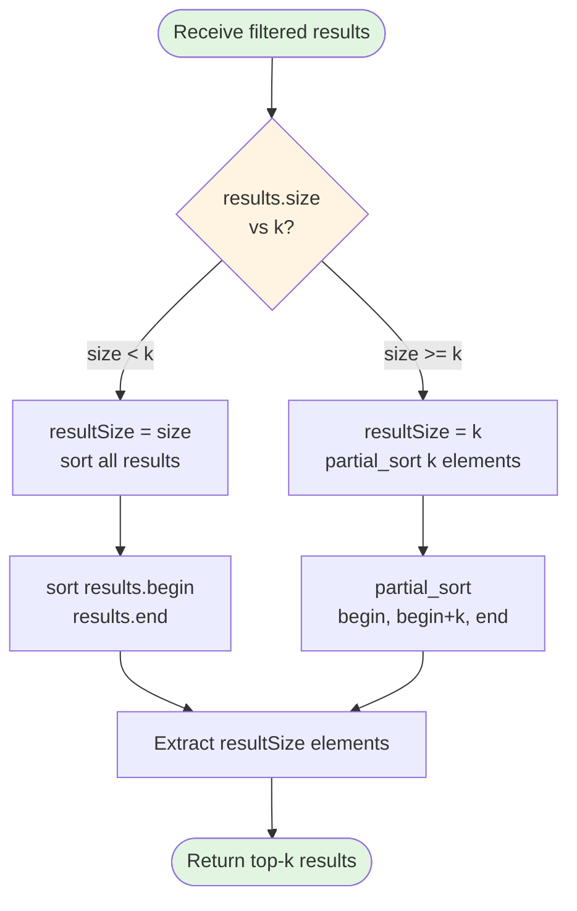

## Memory Management Flow

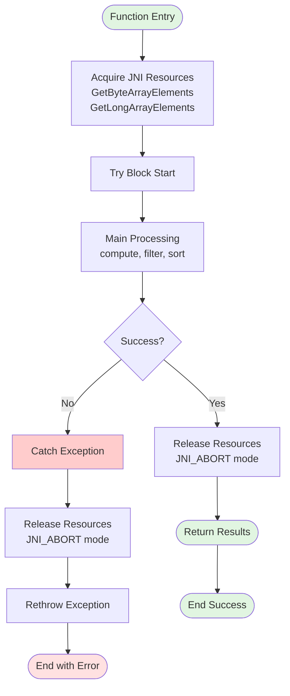

## Complete Sequence Diagram with Hamming Distance API

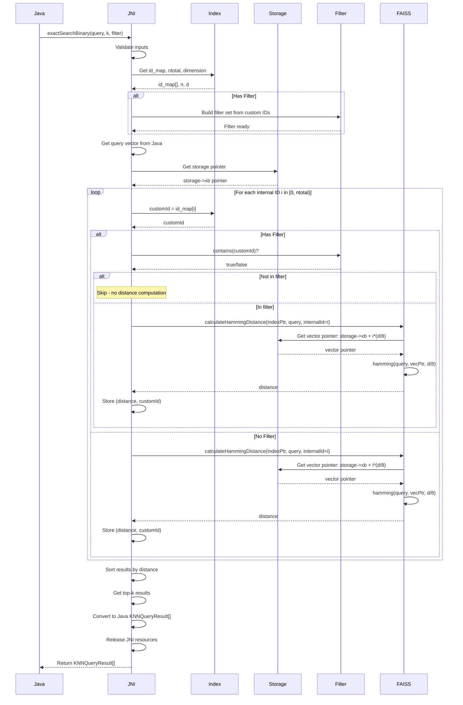

## Optimized Batch Distance Computation

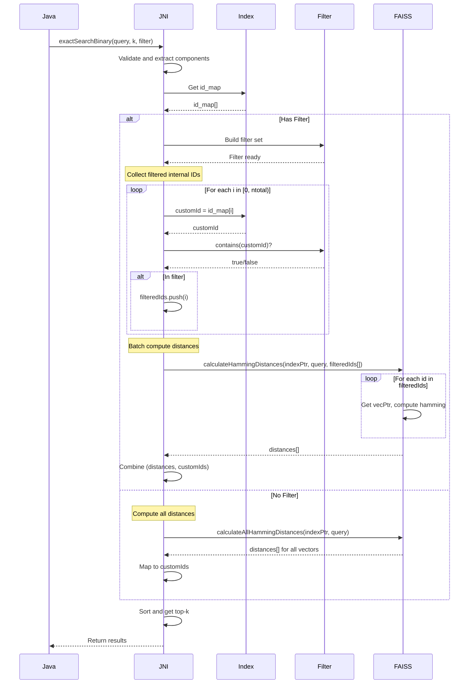

## Performance Comparison

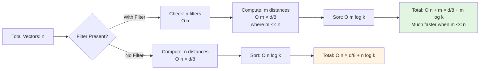

## Key Optimization: Early Filter Check

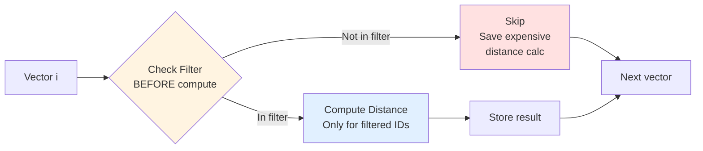


---

# Approach 3: Java Layer Exact Search with JNI Hamming Calls

## Main Flow - Java Layer Implementation

```mermaid
flowchart TD
    Start([Java: exactSearch called]) --> Init[Initialize:<br/>PriorityQueue heap<br/>maxHeap size k]
    
    Init --> GetAllDocs[Get all document IDs<br/>from index]
    GetAllDocs --> HasFilter{Has Filter?}
    
    HasFilter -->|Yes| FilterDocs[Filter document IDs<br/>keep only filtered IDs]
    HasFilter -->|No| UseAll[Use all document IDs]
    
    FilterDocs --> LoopStart[For each docId]
    UseAll --> LoopStart
    
    LoopStart --> LoopCheck{More docs?}
    LoopCheck -->|No| ExtractResults[Extract results<br/>from heap]
    LoopCheck -->|Yes| GetVector[JNI: getVector<br/>indexPtr, docId]
    
    GetVector --> JNICall1[JNI Call]
    JNICall1 --> ReturnVec[Return: byte vector]
    ReturnVec --> CalcDist[JNI: calculateHammingDistance<br/>query, vector]
    
    CalcDist --> JNICall2[JNI Call]
    JNICall2 --> ReturnDist[Return: int distance]
    ReturnDist --> AddHeap[Add to heap:<br/>docId, distance]
    
    AddHeap --> CheckSize{heap.size > k?}
    CheckSize -->|Yes| RemoveMax[heap.poll<br/>remove max distance]
    CheckSize -->|No| NextDoc[Next document]
    RemoveMax --> NextDoc
    NextDoc --> LoopCheck
    
    ExtractResults --> SortHeap[Sort heap by distance]
    SortHeap --> Return([Return KNNQueryResult[]])
    
    style Start fill:#e1f5e1
    style Return fill:#e1f5e1
    style JNICall1 fill:#ffcccc
    style JNICall2 fill:#ffcccc
    style GetVector fill:#ffe1e1
    style CalcDist fill:#ffe1e1
```

## Sequence Diagram - Java Layer with Multiple JNI Calls

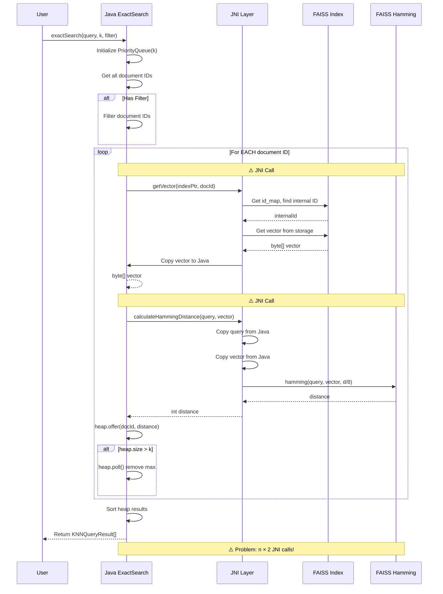

## Performance Problem Visualization

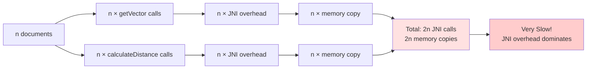

## JNI Overhead Breakdown

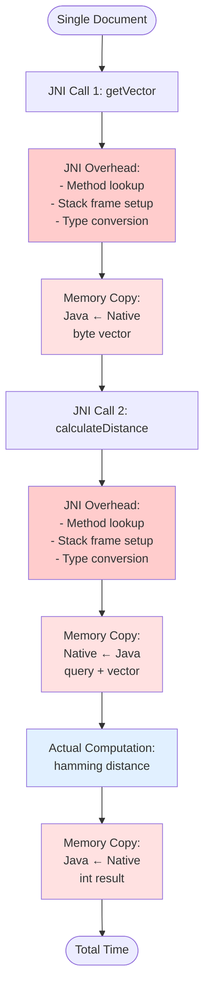

## Comparison: Java vs JNI Implementation

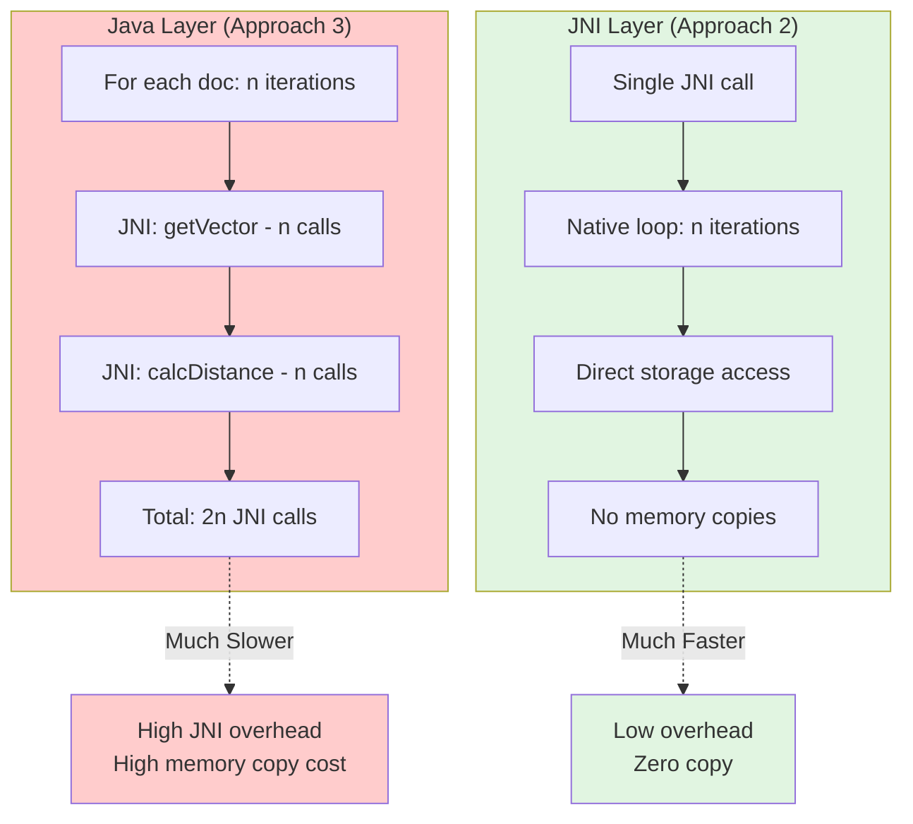

## Memory Copy Overhead

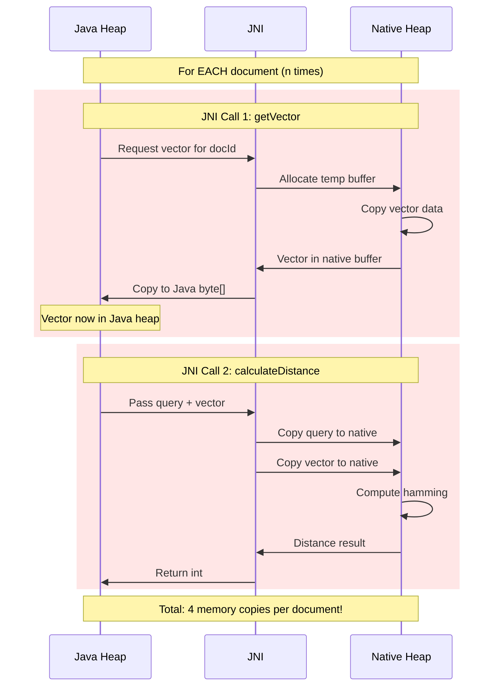

## Performance Metrics Comparison

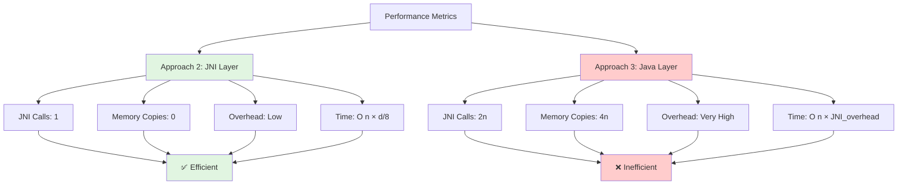

## Why Approach 3 is Not Recommended

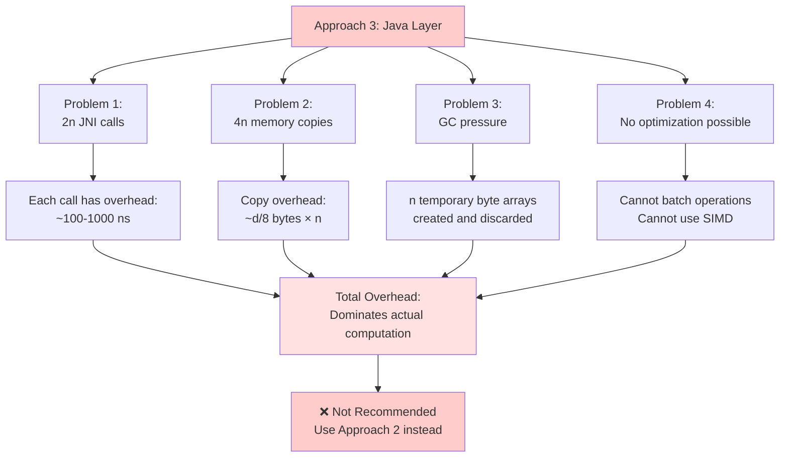

## Recommended Alternative

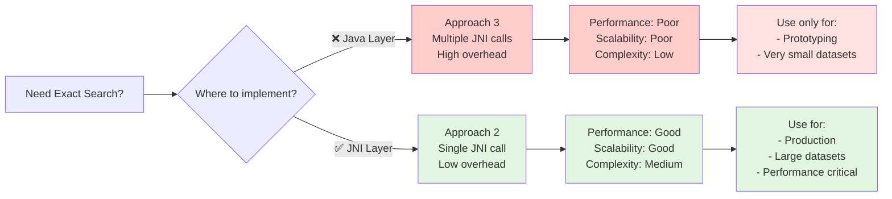
